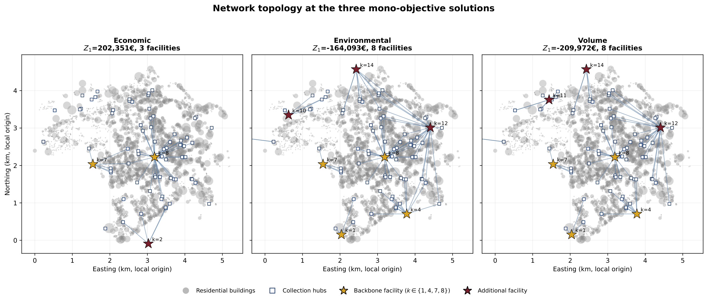
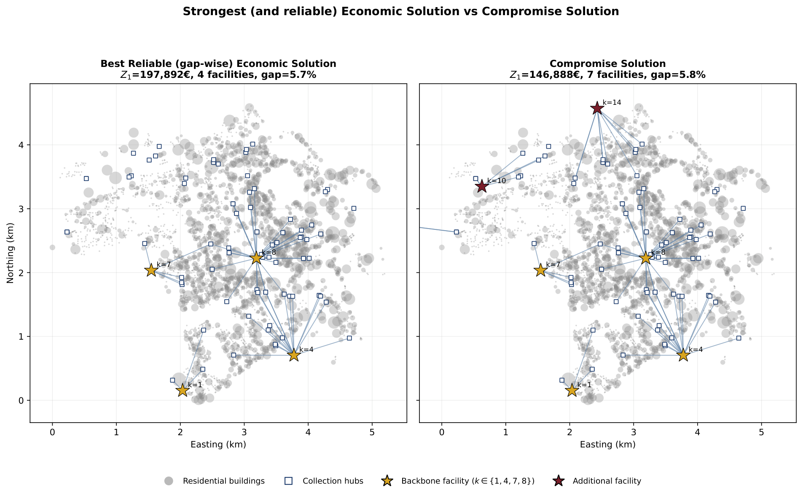
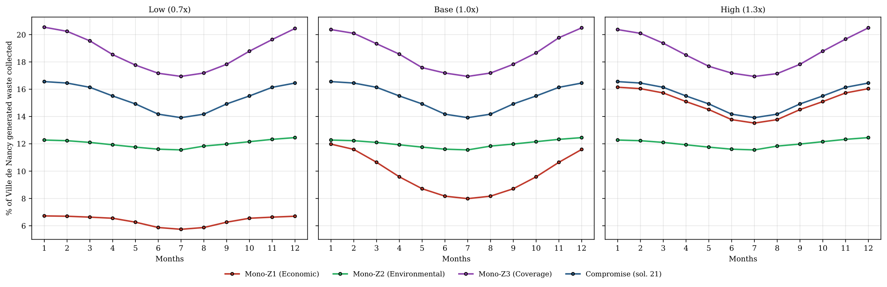
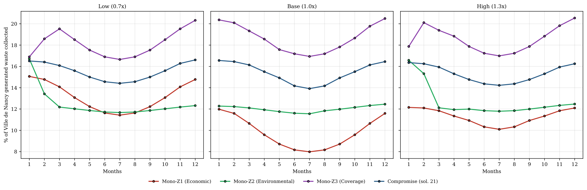
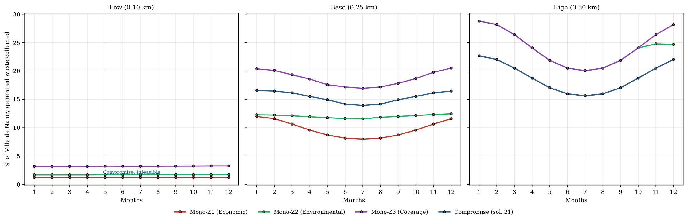

# Designing Distributed Plastic Recycling Networks: A GIS-Informed Multi-Objective Optimization Framework

Code, data and results accompanying the paper

> Cárcamo, N., Espinoza, A., Cruz, F., Kounta, A., Camargo, M., Suescun, C., Boudaoud, H.
> *Designing Distributed Plastic Recycling Networks: A GIS-Informed Multi-Objective Optimization Framework.*

The repository contains the multi-objective MILP used to design a neighborhood-scale plastic
recycling network for the city of Nancy (France), the one-factor-at-a-time (OFAT) sensitivity
analysis reported in the manuscript, all the solver outputs those analyses produced, and the
scripts that turn those outputs into the paper's figures.

---

## 1. The model in one paragraph

Plastic waste (PET, HDPE, PP) generated monthly by residential buildings $i \in \mathcal{I}$ is
dropped off at existing collection hubs $j \in \mathcal{J}$ (schools, markets) and shipped to
small-scale processing facilities $k \in \mathcal{K}$ (fab labs / makerspaces). Only arcs within
a maximum distance are admissible ($\bar d_{ij}$ for residents, $\bar d_{jk}$ for haulage). The
strategic decision is which facilities to open and when ($y_{kt}$, irreversible); flows and
processed quantities are decided every month over a 48-month horizon. Three objectives are
optimized jointly:

| Paper | Code  | Objective | Sense |
|-------|-------|-----------|-------|
| $Z_1$ | `Z4`  | Total net present value of the system (EUR) | max |
| $Z_2$ | `Z2`  | Net greenhouse-gas emissions (kgCO2e), incl. substitution credit | min |
| $Z_3$ | `Z3`  | Population-weighted collection coverage | max |

> **Naming note.** Internally the code keeps its historical objective numbering: the paper's
> economic objective $Z_1$ is `Z4` in every script, CSV and JSON. `Z1` (worst-facility NPV,
> max–min) and `Z5` (recovered output, kg) are *not* optimized; they are computed at every
> solution and reported as diagnostic columns only.

The Pareto front is generated with the augmented ε-constraint method (AUGMECON, Mavrotas 2009)
with the AUGMECON2 bypass (Mavrotas & Florios 2013): `Z4` is the primary objective, `Z2` and
`Z3` become ε-constraints with slack variables, the payoff table is built lexicographically and
a 15×15 grid is swept. The run returned **26 non-dominated configurations** (3 lexicographic
anchors + 23 grid points). Model: Python 3 + Pyomo, solved with Gurobi.

---

## 2. Repository layout

```
.
├── model/                        # source code of the optimization model and analyses
│   ├── sensibilidad.py           # THE MODEL: MILP + AUGMECON/AUGMECON2 Pareto generation
│   ├── build_instances.py        # raw database (.xlsx) -> precomputed instances (data/instances)
│   ├── sensibilidad_articulo.py  # OFAT sensitivity of the 3 lexicographic (mono-objective) solutions
│   ├── sensibilidad_compromiso.py# OFAT sensitivity of the compromise solution (Pareto point 21)
│   └── run_beta_sweep.ps1        # supplementary sweep of the minimum-collection floor beta_min
│
├── data/
│   ├── instances/                # precomputed geographic instances read by the model (JSON)
│   │   ├── zone_full.json        # full city of Nancy (instance used in the paper)
│   │   ├── zone_centro.json, zone_sector_*.json   # smaller sub-zones (quick tests)
│   │   ├── manifest.json         # size of each zone
│   │   └── partition_map.png     # map of the zone partition
│   └── raw/                      # place for the raw database (see data/raw/README.md)
│
├── results/                      # solver outputs used in the paper (read-only reference)
│   ├── pareto_front/             # full Pareto front (26 solutions), BASE scenario, zone full
│   ├── sensitivity_mono/         # OFAT on the 3 mono-objective (lexicographic) solutions
│   ├── sensitivity_compromise/   # OFAT on the compromise solution (point 21)
│   ├── sensitivity_beta_mono/    # supplementary: beta_min sweep, mono-objective solutions
│   └── sensitivity_beta_compromise/ # supplementary: beta_min sweep, compromise solution
│
├── figures/
│   ├── *.pdf                     # figures (vector)
│   ├── png/                      # PNG previews of the same figures
│   ├── fig_model_network_tikz.tex# TikZ schematic of the network
│   └── scripts/                  # one script per figure, reads only from results/ and data/
│
├── requirements.txt
└── CITATION.cff
```

---

## 3. Installation

```bash
git clone https://github.com/nicolascarcamo-v/nancy-plastic-recycling-network.git
cd nancy-plastic-recycling-network
pip install -r requirements.txt
```

**Solver.** The paper's results were obtained with **Gurobi** (an academic licence is free).
`sensibilidad.py` tries, in order, `gurobi`, `cbc`, `appsi_highs` and `glpk`, and uses the first
one available (`SOLVER_ORDER`). Open-source solvers will run the model but are much slower on
the full instance and may not reach the same gaps within the time limit.

All commands below are run **from the repository root**.

---

## 4. Reproducing the results

### 4.1 Figures only (no solver needed)

Every figure is rebuilt from the stored results in a few seconds:

```bash
python figures/scripts/fig_network.py
python figures/scripts/fig_network_comparison.py
python figures/scripts/fig9_monthly_collection_by_scenario.py
python figures/scripts/fig9_monthly_collection_base.py
python figures/scripts/fig9_monthly_collection_sensitivity.py
python figures/scripts/fig8_objectives_compromise_sensitivity.py
python figures/scripts/fig9_monthly_collection_beta.py
```

### 4.2 Pareto front (main model)

```bash
python model/sensibilidad.py --list                 # available scenarios and zones
python model/sensibilidad.py --zone centro          # quick test on a small zone (minutes)
python model/sensibilidad.py --zone full            # paper instance (~6.8 h with Gurobi)
python model/sensibilidad.py --zone full --plot --results results/pareto_front/econ_results.json
```

The run used in the paper is stored in `results/pareto_front/`. Key settings (top of
`sensibilidad.py`): scenario `BASE` ($\bar d_{ij}$ = 0.25 km, $\bar d_{jk}$ = 1.5 km, LCA credit
on), horizon 48 months, time limit 1000 s per subproblem, MIP gap 0.5 %, 15×15 ε-grid.

### 4.3 Sensitivity analysis (OFAT)

Each parameter is perturbed *ceteris paribus* and the solution is **re-optimized** (not just
re-evaluated), so the number and identity of the open facilities may change.

| Scenario | Parameter in code | Base | Levels |
|----------|-------------------|------|--------|
| Price volatility | `PRICE_FACTOR` (multiplies all $p_m$) | 1.0 | ×{0.7, 1.0, 1.3} |
| Catchment sensitivity | `D_BAR_IJ` ($\bar d_{ij}$, km) | 0.25 | {0.10, 0.25, 0.50} |
| Municipal credit intensity | `MUNICIPAL_CREDIT_SHARE` | 0.25 | {0.00, 0.25, 0.50} |
| Facility cost/capacity | `FACILITY_FACTOR` (scales $F_k$ and $\bar Q^{prod}_k$ jointly) | 1.0 | ×{0.7, 1.0, 1.3} |
| *Supplementary:* minimum collection floor | `BETA_MIN` | 0.00 | {0.00, 0.05, 0.10, 0.20} |

Two complementary analyses are run, both anchored on `results/pareto_front/`:

* **Mono-objective solutions** — `sensibilidad_articulo.py` re-solves the three lexicographic
  anchors with the same lexicographic chain as the reference
  (`Z4→Z2→Z3`, `Z2→Z4→Z3`, `Z3→Z4→Z2`), 9 configurations × 3 rows.
* **Compromise solution** — `sensibilidad_compromiso.py` re-solves the AUGMECON subproblem of
  Pareto point 21 (7 facilities {1, 4, 7, 8, 9, 10, 14}) with its ε right-hand sides **fixed in
  absolute value**. If a perturbed level makes that specification unreachable it is reported as
  *infeasible* — that is a result, not an error (it happens at $\bar d_{ij}$ = 0.10 km), and
  `diagnostico_infactibles.csv` records which ε is out of reach.

```bash
python model/sensibilidad_articulo.py   --dry-run                        # plan + model sizes, no solve
python model/sensibilidad_articulo.py   --outdir results/my_mono         # all 4 scenarios
python model/sensibilidad_compromiso.py --outdir results/my_compromise   # all 4 scenarios
python model/sensibilidad_compromiso.py --only catchment --outdir results/my_compromise
powershell -ExecutionPolicy Bypass -File model/run_beta_sweep.ps1        # supplementary beta sweep
```

Runs resume automatically (a configuration whose results file already exists is skipped; use
`--force` to re-solve). Each solution is warm-started from its reference solution.

### 4.4 Rebuilding the instances from the raw database (optional)

`data/instances/*.json` are already provided. To regenerate them, place
`Base_de_datos_FINAL_v2.xlsx` in `data/raw/` (see `data/raw/README.md`) and run

```bash
python model/build_instances.py
```

---

## 5. Results files

Every results folder follows the same structure.

**`results/pareto_front/`**
* `econ_results.json` — full output: payoff table, every Pareto point (objectives, open
  facilities, flows), solver metadata and instance geometry.
* `detalle_csv/soluciones.csv` — one row per solution (`sol` 1–3 are the lexicographic anchors
  of `Z4`, `Z2`, `Z3`; 4–26 are ε-grid points): objectives, open facilities, ε values, gap, time.
* `detalle_csv/plantas_apertura.csv` — opening period, NPV and production of each open facility.
* `detalle_csv/plantas_temporal.csv` — monthly production per polymer, revenue, costs, emissions.
* `detalle_csv/hubs_temporal.csv` — monthly inflow to each hub.
* `detalle_csv/flujos_jk.csv` — hub → facility flows.
* `detalle_csv/zonas_cobertura.csv` — waste generated / collected per building.
* `detalle_csv/Figures/fig_pareto3d.html` — interactive 3-D Pareto front.

**`results/sensitivity_*/`**
* `sensibilidad_monoobj.csv` / `sensibilidad_compromiso.csv` — **main table**: one row per
  (scenario, level[, objective]) with all objectives, open facilities, deltas vs. reference, gap.
* `cardinalidad*.csv` — number of open facilities and which ones enter/leave vs. the reference.
* `plantas_frecuencia.csv` / `plantas_detalle.csv` — one row per open facility.
* `payoff_tables.csv` — payoff table of each configuration (mono-objective analysis).
* `diagnostico_infactibles.csv` — diagnosis of infeasible levels (compromise analysis).
* `runs/<run_id>/` — full solution (`*_results.json`), detailed CSVs, exact `run_config.json`
  and the solver log of each configuration.

> The `reference` field inside `run_config.json` / `runs_manifest.json` still shows the
> original folder name `resultsfull120715x15`, which is the run now stored as
> `results/pareto_front/`.

### Compromise solution under the OFAT analysis (`results/sensitivity_compromise/sensibilidad_compromiso.csv`)

| Scenario | Level | NPV $Z_1$ (EUR) | GHG $Z_2$ (kgCO2e) | Coverage $Z_3$ | # facilities |
|----------|-------|----------------:|-------------------:|---------------:|:------------:|
| Base | — | 146,888 | −142,545 | 60,036 | 7 |
| Price | 0.7 | −43,884 | −142,545 | 60,036 | 7 |
| Price | 1.3 | 337,660 | −142,545 | 60,036 | 7 |
| Catchment | 0.10 km | infeasible | — | — | — |
| Catchment | 0.50 km | 377,129 | −344,123 | 72,432 | 5 |
| Municipal credit | 0.00 | 85,701 | −142,545 | 60,036 | 7 |
| Municipal credit | 0.50 | 208,074 | −142,545 | 60,036 | 7 |
| Facility cost/capacity | 0.7 | −19,049 | −149,627 | 60,438 | 9 |
| Facility cost/capacity | 1.3 | 92,856 | −137,125 | 60,036 | 6 |

Solutions are incumbents returned within the time limit; the `gap_pct` column of every table
reports the optimality gap of each one (e.g. the base compromise point closed at 5.8 %, the
economic anchor `Z4` at 42.8 %) and should be read alongside the objective values.

---

## 6. Figures

| File | Content | Script |
|------|---------|--------|
| `fig_studyarea.pdf` | Study area: buildings, hubs and candidate facilities in Nancy | — (static) |
| `fig_network1.pdf` | Network topology at the three lexicographic anchors (economic / environmental / volume) | `fig_network.py` |
| `fig_network_comparison1.pdf` | Network growth from the best reliable economic solution (sol. 4) to the compromise solution (sol. 21) | `fig_network_comparison.py` |
| `fig9_monthly_collection_{price,facility,catchment}.pdf` | Paper's sensitivity figure: monthly % of Nancy's generated waste collected by each solution, one panel per level | `fig9_monthly_collection_by_scenario.py` |
| `fig9_monthly_collection_muncredit.pdf`, `..._all_scenarios.pdf` | Same, municipal credit scenario / all scenarios combined | `fig9_monthly_collection_by_scenario.py` |
| `fig9_monthly_collection_base.pdf` | Monthly collection, base case | `fig9_monthly_collection_base.py` |
| `fig9_monthly_collection_sensitivity.pdf` | Monthly collection, one panel per scenario | `fig9_monthly_collection_sensitivity.py` |
| `fig8_objectives_compromise_sensitivity.pdf` | % change of every objective of the compromise solution under OFAT | `fig8_objectives_compromise_sensitivity.py` |
| `fig9_monthly_collection_beta.pdf` | Supplementary: effect of a minimum collection floor $\beta_{min}$ | `fig9_monthly_collection_beta.py` |

**Network topology at the three lexicographic anchors**



**From the best economic solution to the compromise solution**



**Sensitivity — price volatility**



**Sensitivity — facility cost/capacity**



**Sensitivity — catchment radius** (the compromise specification is infeasible at 0.10 km)



In the monthly-collection figures the denominator is the **real** waste generated by all
13,458 buildings of the city (`data/instances/zone_full.json → w_imt`), fixed across scenarios,
so the curves are comparable between levels.

---

## 7. Implementation notes

* The three points where the implementation departs from the cited method are isolated behind
  flags at the top of `sensibilidad.py` (`AUGMECON2_BYPASS`, `EPS_FEAS_TOL_FRAC`,
  `TIEBREAK_OPEN_W`); see the header *"Fidelidad al método citado"*.
* Candidate facilities closer than `D_BAR_KK_KM` = 0.6 km are clustered, and a connectivity
  filter keeps only candidates reachable from the hub network; in the full instance this leaves
  76 hubs and 10 candidate facilities.
* Source-code comments are written in Spanish.

---

## 8. Citation

If you use this code or data, please cite the paper (see `CITATION.cff`).

## 9. Contact

Nicolás Cárcamo — Departamento de Ingeniería Industrial, Universidad de Santiago de Chile
(USACH) — nicolas.carcamo.v@usach.cl
